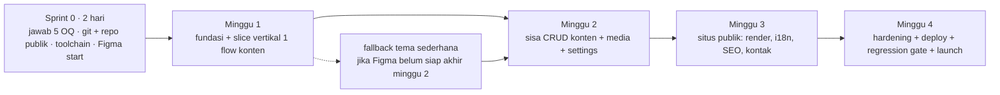

# RUNDOWN — Analisis PRD & Rencana Eksekusi Personal Website

# Author: Sepuh-Analyst | Date: 2026-10-07 | Versi: 1.0
# Status: FINAL (rundown diskusi) | Sumber: PRD.md v1.0 (275 baris, greenfield — repo awalnya hanya berisi PRD)

---

## 1. Ringkasan Analisis

PRD berada di kategori **siap-eksekusi**: scope vs out-of-scope eksplisit, keputusan stack + alasan + alternatif yang ditolak (bab 10 praktis mini-ADR), data model konseptual, acceptance criteria terukur, mitigasi risiko lengkap. Tidak perlu dibongkar — perlu **diperbarui di 4 titik kecil** (Bab 3) lalu dieksekusi dengan disiplin eksekusi yang benar: jawab 5 open question di 2 hari pertama, bangun **slice vertikal** di minggu 1 (bukan tumpukan CRUD), tulis test per-fitur (bukan menumpuk di minggu 4), dan mulai konten ID/EN di minggu 1.

Dua asumsi teknis rawan di PRD sudah terverifikasi dan berubah (Bab 2). Sisa blocker hanya OQ #1 (hosting) dan #2 (email provider) — keduanya keputusan bisnis, bukan teknis.

## 2. Hasil Verifikasi Eksternal (2 putaran riset, 7 Oktober 2026)

### Putaran 1 — Filament & MFA

| Klaim PRD (bab 10) | Hasil verifikasi | Konsekuensi |
| --- | --- | --- |
| "Dukungan 2FA kode-email perlu diverifikasi; jika tidak ada, dibuat custom" | **Terjawab**: Filament punya **MFA bawaan** sejak v4 — *email authentication* (kode sekali pakai ke email, challenge sebelum session dibuat) dan *TOTP app*, diaktifkan via `multiFactorAuthentication()` pada panel. Plugin komunitas juga tersedia bila perlu kustomisasi. [Terverifikasi: filamentphp.com/docs — Multi-factor authentication] | FR-AUTH-1 s/d FR-AUTH-4 sebagian besar tidak dibangun manual; estimasi minggu 1 jadi longgar |
| "Laravel versi stabil terbaru" | Filament v4 butuh PHP 8.2+, Laravel ≥ 11.28, Tailwind 4.1+. **Filament v5 adalah versi stabil terkini** (v4 jadi "previous version"); keduanya aktif dipatch per Agustus 2026 (v4.12.6 & v5.7.6). [Terverifikasi: filamentphp.com] | Pin Filament v5; cek kompatibilitas plugin di hari instalasi, fallback v4.12 juga aman |

### Putaran 2 — Ekosistem plugin Spatie

| Komponen | Hasil verifikasi | Konsekuensi |
| --- | --- | --- |
| Plugin Filament untuk `spatie/laravel-translatable` | Plugin **resmi Filament sudah abandoned**; penerus resminya `lara-zeus/spatie-translatable` — **v1.x untuk Filament v4, v2.x untuk Filament v5** (2.0.1, April 2026; aktif). Paket inti `spatie/laravel-translatable` 6.14.1 (April 2026), PHP ≥ 8.3, Laravel 11–13. [Terverifikasi: Packagist] | Update nama paket di bab 10; jangan pasang `filament/spatie-laravel-translatable-plugin` yang abandoned |
| `spatie/laravel-medialibrary` | Terkini **11.23.x** (rilis terakhir Sep 2026; aktif), PHP ≥ 8.2, Laravel 10–13. **CVE-2026-48557 (High, CVSS 8.7): file upload restriction bypass** pada versi < 11.23.0 — nama file seperti `shell.php.jpg` lolos blocklist sanitizer. Patched di 11.23.0 (Mei 2026). [Terverifikasi: GitHub Advisory Database + Packagist] | **Pin ≥ 11.23.0 sejak hari pertama.** Memperkuat FR-MED-4: randomize nama file + lokasi non-eksekusi wajib, bukan opsional |
| Plugin media & settings resmi Filament | `filament/spatie-laravel-media-library-plugin` rilis mengikuti Filament v4.12 dan **v5.7**; plugin settings ada sebagai subtree resmi. [Terverifikasi: Packalyst + GitHub subtree Filament] | Jejak Filament v5 feasible untuk seluruh kebutuhan PRD |

**Versi stack final terverifikasi:** Laravel versi stabil terbaru yang resolve bersama dependensi (constraints tersedia untuk Laravel 11–13; pilih terbaru saat instalasi) + **Filament v5** + **lara-zeus/spatie-translatable v2** + **spatie/laravel-medialibrary ≥ 11.23** + **MFA bawaan panel** (Email/TOTP) + Blade/Tailwind/Alpine untuk situs publik.

## 3. Koreksi ke PRD (lakukan sebelum minggu 1)

1. **Bab 10, baris Filament:** hapus klausa "jika tidak ada, dibuat custom" untuk 2FA kode email — MFA email bawaan sudah ada.
2. **Bab 10, baris i18n:** nama plugin = `lara-zeus/spatie-translatable` (penerus plugin resmi yang abandoned); pin Filament v5.
3. **Bab 10, baris media:** tambahkan syarat katup `medialibrary ≥ 11.23.0` karena CVE-2026-48557.
4. **Bab 14 (timeline):** testing tidak boleh ditumpuk di minggu 4 — geser ke **per-fitur** (minggu 1 = test auth; minggu 2 = test draft/publish; dst.) sehingga minggu 4 tinggal regression gate.

## 4. Lima Open Question yang Menghambat Sprint 0 (PRD bab 16)

| OQ | Pertanyaan | Kenapa menghambat |
| --- | --- | --- |
| #1 | Hosting? | Menentukan DB (MySQL vs SQLite), cron/scheduler, dan akses queue worker persisten — kode login email adalah queue job, tanpa worker login mati senyap |
| #2 | Email provider? | Kode login (minggu 1) dan notifikasi kontak (minggu 3) tergantung ini |
| #4 | Struktur 1 halaman berseksi + detail project? | Menentukan routing cache, SEO, dan desain Figma |
| #7 | TOTP tambahan? | Dengan MFA bawaan Filament, jawaban "ya" hampir gratis — tinggal centang |
| #8 | Siapa menulis konten ID/EN, kapan? | Konten asli adalah pekerjaan penulis, butuh slot mulai minggu 1 — tidak bisa dimampatkan di minggu 4 |

Semuanya sudah punya asumsi default masuk akal di PRD — tinggal dikonfirmasi pemilik, bukan probing ulang.

## 5. Rencana Eksekusi

### Sprint 0 — 2 hari pertama (sebelum kode PHP mana pun)

1. Konfirmasi 5 OQ di atas (host, email provider, struktur halaman, TOTP, penulis konten).
2. `git init` + repo GitHub **publik** sejak commit #1: `.gitignore` menutup `.env`/upload/dump, `.env.example` disiapkan — AC-10 murah dipenuhi bila disiplin sejak awal, mahal bila dibersihkan belakangan.
3. Toolchain lokal: PHP ≥ 8.2 (requirement Filament) [Terverifikasi], Composer, Node LTS.
4. Desain Figma di-start hari yang sama — PRD §14/§15 menyatakan desain adalah dependensi terbesar timeline.

### Minggu 1 — Fundasi + slice vertikal

- Setup Laravel + Filament panel: path `/admin` configurable (FR-ADM-1), tanpa route register (FR-ADM-2), akun via seeder/artisan (FR-ADM-2).
- Migrasi data model bab 8 + seeder konten demo; field translatable sebagai JSON per bahasa.
- MFA panel via bawaan Filament (email code), rate limit + lockout sesuai config (FR-AUTH-3/4), jalur pemulihan artisan (FR-AUTH-7).
- Queue `database` + mailer sandbox lokal.
- **Slice vertikal wajib:** satu flow Project end-to-end — resource admin → draft/publish + preview (FR-ADM-8) → halaman detail publik `/projects/{slug}` (FR-PUB-3) dengan draft 404 (FR-PUB-4). Slice ini memaksa 4 keputusan tooling tereksekusi sebagai bukti: field translatable JSON, konversi media WebP, cache-invalidate saat publish (FR-ADM-10), routing i18n. Kegagalan di sini revisi desain data — lebih murah ketemu minggu 1 daripada minggu 3.
- **Gate minggu 1:** AC-2 lulus sebagai feature test (password + kode email; expired/reused/salah berulang ditolak).

### Minggu 2 — Sisa panel admin

- Sisa resource: Profile (single-row), Experience, Skill, SiteSettings (kandidat plugin settings resmi Filament).
- Media: cover, galeri, CV per bahasa, alt text per bahasa (FR-ADM-3/5, FR-MED-1/2/3).
- Drag-and-drop urutan Project/Pengalaman/Skill (FR-ADM-9), konfirmasi hapus (FR-ADM-11).
- Tabs translatable ID/EN + penanda fallback EN kosong (FR-I18N-3).
- **Gate:** AC-1 (simpan admin → tampil publik < 1 menit tanpa deploy), AC-3 (draft 404 di publik termasuk tebak URL), AC-7 (upload menolak tipe/ukuran salah).

### Minggu 3 — Situs publik + integrasi

- Render section sesuai FR-PUB-1/2 + responsive hingga 360px (FR-PUB-7), 404/error bergaya (FR-PUB-6).
- Routing i18n `/` (ID) dan `/en`, toggle + cookie (FR-I18N-1/2), hreflang (`FR-SEO-4`), dark/light tanpa flash (FR-THEME-1).
- SEO pack: title/description/canonical, OG + Twitter Card, sitemap + robots, admin noindex (FR-SEO-1/2/3/5), JSON-LD Person.
- Form kontak + Turnstile + honeypot + rate limit (FR-CON-2), inbox admin (FR-CON-3), notifikasi via queue — kegagalan email tidak menggagalkan simpan pesan (FR-CON-4).
- **Gate:** AC-4, AC-5, AC-6.

### Minggu 4 — Launch

- Deploy + Cloudflare (DNS/SSL/CDN/Web Analytics), backup DB + upload berkala.
- Hardening pass (security headers, sanitasi rich text, audit secret repo), Lighthouse desktop sesuai target.
- Konten asli ID/EN final, README lengkap.
- **Gate:** AC-8, AC-10, plus semua test minggu 1–3 tetap hijau (regression).

## 6. Pitfall — Empat Kesalahan Paling Berisiko untuk Profil Ini

1. **Bangun semua CRUD serentak tanpa slice vertikal.** Masalah integrasi translatable + media + cache baru ketemu minggu 3–4 saat waktu habis. Slice Project dulu, sisanya menyusul.
2. **Custom-override Filament terlalu dini.** Pakai perilaku default dulu; hanya dua custom wajib minggu 1 (path panel, tanpa register). Tema/polish menyusul minggu 3–4 — tampilan admin tidak perlu unik (PRD bab 10 sudah memutuskan ini).
3. **Queue worker & scheduler terlupakan di hosting murah.** Kode login email dan notifikasi kontak adalah queue job; tanpa worker persisten, fitur inti (login!) mati senyap. OQ #1 hanya boleh disetujui bila jawabannya memuat "queue worker jalan".
4. **Konten asli dikerjakan di minggu 4.** Menulis bio/pengalaman/project dua bahasa adalah pekerjaan penulis, bukan developer; mulai draft di Google Docs sejak minggu 1 (OQ #8).

## 7. Aksi Hari Ini (tanpa kode)

1. Konfirmasi 5 OQ: host, email provider, struktur halaman, TOTP/tidak, penulis konten.
2. `git init` + repo publik, disiplin `.gitignore`/`.env.example` sejak commit pertama.
3. Start desain Figma hari yang sama (dependensi terbesar timeline).
4. Install Laravel stabil + Filament v5; cek 15 menit bahwa `lara-zeus/spatie-translatable` v2 + `filament/spatie-laravel-media-library-plugin` (versi v5.7) resolve bersih di `composer.json`; jika macet, fallback Filament v4.12 (masih dipatch).
5. Tulis feature test auth sejak minggu 1 — bukan menumpuknya di minggu 4.

## 8. Posisi

PRD layak dieksekusi tanpa redraw; yang menentukan bukan pilihan stack (sudah terverifikasi matang) melainkan tiga hal di luar kode: keputusan 5 OQ di Sprint 0, disiplin slice vertikal minggu 1, dan keberlanjutan konten ID/EN yang juga mulai minggu 1. Mulai dari situ — bukan dari halaman publik.

## 9. Status & Langkah Berikutnya

- Dokumen ini **rundown diskusi**, bukan tugas implementasi — parameter berikutnya: (a) kunci keputusan versi stack jadi **ADR-001** di `docs/adr/`, (b) pecah rencana jadi **ROADMAP + backlog epic** formal, atau (c) langsung Sprint 0 dan kembali untuk sparring saat butuh.
- Dokumen asumsi: nama file mengikuti permintaan pemilik (`ROUNDOWN.md`, alias rundown analisis), berkas sudah ada sebelumnya dalam kondisi kosong (0 baris) sehingga tidak menimpa konten apa pun.

## 10. Referensi & Grounding

| Sumber | Tanggal akses | Label |
| --- | --- | --- |
| `PRD.md` di repo (275 baris) | 2026-10-07 | [Terverifikasi: berkas lokal] |
| filamentphp.com — docs 4.x Multi-factor authentication (MFA bawaan: Email + TOTP), upgrade guide, getting-started, insight rilis v4 stabil & patch v4.12.6/v5.7.6 | 2026-10-07 | [Terverifikasi: web] |
| Packagist — `filament/spatie-laravel-translatable-plugin` (abandoned → lara-zeus), `lara-zeus/spatie-translatable` v2.0.1 (Filament v5), `spatie/laravel-translatable` 6.14.1 | 2026-10-07 | [Terverifikasi: web] |
| Packalyst/GitHub — `spatie/laravel-medialibrary` 11.23.x aktif (Sep 2026), `filament/spatie-laravel-media-library-plugin` v4.12/v5.7 | 2026-10-07 | [Terverifikasi: web] |
| GitHub Advisory Database — CVE-2026-48557 (High 8.7, patched 11.23.0, Mei 2026) | 2026-10-07 | [Terverifikasi: web] |
| Status kompatibilitas penuh Laravel-versi-tepat saat instalasi, kompatibilitas plugin di Filament v5 | - | [BELUM DIVERIFIKASI — cek 15 menit di hari instalasi] |

## Changelog

| Versi | Tanggal | Perubahan |
| --- | --- | --- |
| 1.0 | 2026-10-07 | Rundown awal dari analisis 2 sesi verifikasi (Filament MFA bawaan plugin ecosystem, CVE medialibrary, rencana Sprint 0–Minggu 4) |
