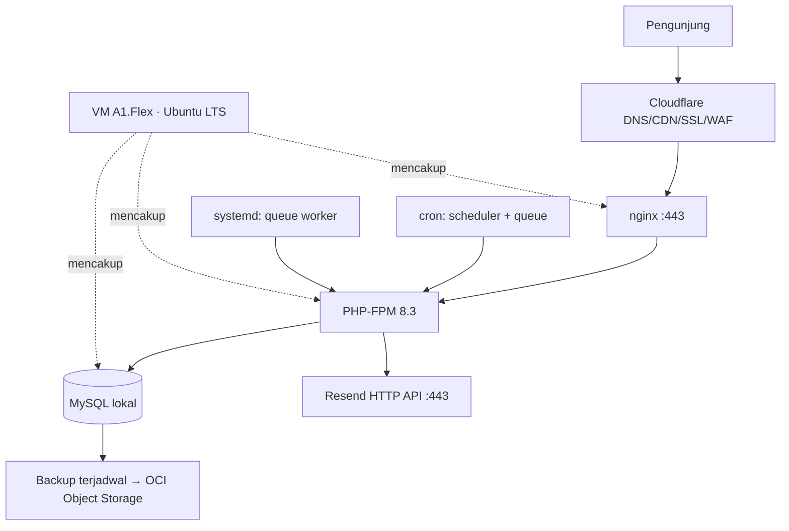

# WORKFLOW — Eksekusi & Hosting di Oracle Cloud Always Free

# Author: Sepuh-Analyst | Date: 2026-10-08 | Versi: 0.1
# Status: DRAFT (menunggu konfirmasi keputusan di Bab 1)
# Sumber: PRD.md v1.0 · ROUNDOWN.md v1.0 · verifikasi docs.oracle.com (Always Free Resources), 8 Okt 2026

---

## 1. Keputusan & Asumsi (WAJIB dikonfirmasi sebelum W0)

| # | Keputusan | Nilai usulan | Status |
| --- | --- | --- | --- |
| D1 | Hosting | OCI Always Free, shape **VM.Standard.A1.Flex** ARM | Dipilih pemilik |
| D2 | Home region | **Singapura** (latensi terbaik untuk Indonesia) — Alternatif: Jepang/Korea | [ASUMSI] — ketersediaan A1 harus dicek saat signup |
| D3 | Distribusi OS | **Ubuntu LTS** | [ASUMSI] |
| D4 | Database | **MySQL** (peringkat di bawah Postgres hanya karena tidak signifikan untuk data sekecil ini); SQLite tetap opsi paling ringan | [ASUMSI] |
| D5 | Email transaksional | **Resend via HTTP API** (menghindari blokir port 25 OCI); alternatif: OCI Email Delivery | [ASUMSI] |
| D6 | SSL | Cloudflare di depan (proxy on) + sertifikat origin | [ASUMSI] |
| D7 | Domain | Registrar pihak ketiga, `.com` | [ASUMSI] |

Catatan D2: Always Free **hanya berlaku di home region** dan sifatnya permanen untuk tenancy — putuskan dengan hati-hati. A1 tidak tersedia di South Korea North (Chuncheon).

## 2. Kapasitas Gratis yang Kamu Dapat (terverifikasi)

| Sumber daya | Kuota Always Free | Relevansi |
| --- | --- | --- |
| Compute A1 ARM | ≤ **2 OCPU + 12 GB RAM** total (1.500 OCPU-jam + 9.000 GB-jam/bulan), alokasi fleksibel 1–2 instance | Cukup lega untuk Laravel + DB + worker + cron |
| Compute AMD micro | 2× E2.1.Micro (masing-masing 1 GB RAM, 50 Mbps) | Cadangan/opsional, bukan andalan |
| Block volume | **200 GB** total (boot volume default 50 GB, minimum 47 GB) | Data + backup lokal |
| Outbound transfer | **10 TB/bulan** | Jauh lebih dari kebutuhan |
| Object Storage | **20 GB** + 50.000 request API/bulan | Target backup terjadwal |
| Email Delivery | **3.000 email/bulan** | Alternatif D5 tanpa layanan pihak ketiga |
| Vault | 150 secret | Alternatif penyimpanan kredensial |
| Load balancer | 1× flexible 10 Mbps | Tidak dipakai untuk MVP (single VM) |

## 3. Topologi Target (MVP)

Prinsip: satu VM, satu tanggung jawab jelas per proses (nginx, php-fpm, mysql, worker, cron), tanpa Redis (PRD memakai queue database dan page cache — cukup di skala ini).

## 4. Fase Workflow

### W0 — Akun & Infrastruktur (target: 1 hari)

1. Daftar OCI, verifikasi identitas/pembayaran (kartu; tidak ada tagihan selama di kuota Always Free).
2. Set home region sesuai D2. Antisipasi error **"out of host capacity"**: coba availability domain lain atau ulangi beberapa saat kemudian — ini normal untuk A1.
3. Buat VCN + subnet publik, security list minimal (hanya 80/443 terbuka; SSH dibatasi ke IP kamu atau via Bastion).
4. Provision 1 instance A1.Flex (usulan 2 OCPU/12 GB) + boot volume sesuai kebutuhan (mis. 100 GB, sisa kuota untuk backup).
5. Hardening dasar: SSH key-only, non-root user dengan sudo, auto security updates, firewall host selaras dengan security list.
6. DNS: arahkan domain ke Cloudflare, aktifkan proxy, TLS mode yang benar.

**Exit criteria W0:** instance bisa di-SSH, VCN aman, DNS mengarah ke Cloudflare, tidak ada biaya di luar Always Free.

### W1 — Runtime & Deploy Pertama (target: 1 hari, sejalan ROUNDOWN Minggu 1)

7. Pasang runtime: nginx, PHP 8.3+, ekstensi wajib Laravel + `intl`, Composer, MySQL server.
8. Siapkan struktur direktori rilis (rilis berbasis git atau arsip) dan konfigurasi virtual host publik.
9. Deploy aplikasi Laravel: dependency, `.env` produksi (diturunkan dari `.env.example`, **tanpa secret di repo**), key aplikasi, migrasi + seeder.
10. Proses latar belakang:
    - **Worker** sebagai service systemd (auto-restart) untuk queue database — memenuhi FR-CON-4 dan FR-AUTH.
    - **Scheduler** lewat cron menitam (Laravel scheduler) untuk expiry kode login dan cleanup.
11. Email: konfigurasi Resend HTTP API (D5) atau OCI Email Delivery; verifikasi SPF/DKIM domain sebelum dipakai untuk kode login.
12. TLS: sertifikat origin via Cloudflare.

**Exit criteria W1:** halaman bisa diakses via HTTPS melalui Cloudflare; **kirim kode login email end-to-end berhasil (FR-AUTH-2)**; job queue terlihat diproses; scheduler berjalan.

### W2 — Modul Admin (sejalan ROUNDOWN Minggu 2)

13. Tidak ada penyesuaian hosting khusus. Yang wajib dipastikan: direktori upload media berada di luar web root dan persisten (bukan ephemeral), serta permission benar.
14. Gate: AC-1 (publish → tampil < 1 menit), AC-3 (draft 404), AC-7 (upload invalid ditolak).

### W3 — Situs Publik & Integrasi (sejalan ROUNDOWN Minggu 3)

15. Kontak + Turnstile + rate limit; pastikan notifikasi email lewat queue, kegagalan email tidak menggagalkan penyimpanan pesan (FR-CON-4).
16. Aturan cache Cloudflare: cache aset statis agresif, jangan cache halaman yang dipengaruhi sesi admin; canonical/hreflang tetap benar saat di-cache.
17. Gate: AC-4, AC-5, AC-6.

### W4 — Hardening, Backup & Launch (sejalan ROUNDOWN Minggu 4)

18. **Backup terjadwal**: dump database + arsip upload → OCI Object Storage (kuota 20 GB). Backup lokal juga, jangan hanya satu lokasi. **Uji restore minimal sekali.**
19. **Monitoring anti-idle** (lihat Bab 5).
20. Lighthouse desktop sesuai target; uji akses publik tanpa JS; audit secret di repo.
21. Simpan SSH key, `.env`, dan kredensial di luar server (password manager), bukan hanya di VM.
22. Launch; catat runbook darurat (cara restore, cara mematikan/nyalakan instance, kontak eskalasi).

## 5. Risiko Khas Oracle Always Free & Mitigasi

| Risiko | Fakta | Mitigasi |
| --- | --- | --- |
| **Idle reclamation** | Instance Always Free bisa ditarik bila selama 7 hari: CPU p95 < 20%, jaringan < 20%, memori < 20% (khusus A1) [Terverifikasi] | Jadwalkan beban ringan tapi nyata (scheduler tetap berjalan, backup, health check); pasang uptime monitor eksternal yang memukul endpoint secara berkala; pantau notifikasi OCI |
| "Out of host capacity" | Keterbatasan sementara shape A1 di home region [Terverifikasi] | Coba AD lain / ulangi; jangan panik; instance yang sudah jalan tidak terpengaruh |
| Port 25 diblokir default | Tenancy baru tidak boleh SMTP keluar port 25; butuh exemption [Terverifikasi] | Pakai email via HTTP API (D5) — tidak menyentuh port 25 |
| Single VM = single point of failure | Tidak ada redundansi | Backup off-site + dokumentasi restore; terima trade-off untuk situs personal |
| Tidak ada backup terkelola | VM/DB di luar layanan terkelola | Backup otomatis ke Object Storage + uji restore |
| Beban pemeliharaan OS/PHP | Kamu yang patch | Auto security updates + upgrade terjadwal; pin versi Filament sesuai PRD |

## 6. Fallback & Rollback

- **Gagal dapat instance A1** setelah beberapa hari mencoba → pakai 2× micro AMD (kuota 1 GB RAM, cocok hanya untuk SQLite + beban ringan) **atau** pindah ke GCP e2-micro, **atau** berhenti bereksperimen dan ambil Laravel Cloud Starter (bulan pertama gratis, ~$5–7/bln sesudahnya).
- **Idle reclamation menimpa instance produksi** → restore dari backup ke instance baru; jangan bergantung pada snapshot OCI.
- Aturan praktis: setiap fase yang macet > 2 hari, pindah jalur, jangan pasung timeline 4 minggu pada satu platform.

## 7. Yang Tidak Termasuk di Dokumen Ini

- Kode, konfigurasi, atau skrip siap-pakai (domain agen implementasi).
- Rencana fitur per minggu (ada di `ROUNDOWN.md`).
- Keputusan versi stack final dan timeoutnya (kandidat `docs/adr/ADR-001`).

## 8. Open Questions

| # | Pertanyaan | Kenapa penting |
| --- | --- | --- |
| Q1 | Home region jadi Singapura? A1 tersedia? | Permanen untuk tenancy; menentukan latensi |
| Q2 | MySQL vs Postgres vs SQLite? | Menentukan backup, tuning, dan konsumsi RAM |
| Q3 | Resend atau OCI Email Delivery? | Jalur kode login admin |
| Q4 | Registrar domain? | Satu-satunya biaya tetap |

## 9. Referensi & Grounding

| Sumber | Tanggal | Label |
| --- | --- | --- |
| `PRD.md`, `ROUNDOWN.md` di repo | 2026-10-08 | [Terverifikasi: berkas lokal] |
| Oracle docs — Always Free Resources (kuota, idle reclamation, port 25, out of host capacity, A1 regional) | 2026-10-08 | [Terverifikasi: web] |
| Ketersediaan A1/region saat signup, hasil verifikasi pembayaran akun | - | [BELUM DIVERIFIKASI — cek di W0] |

## Changelog

| Versi | Tanggal | Perubahan |
| --- | --- | --- |
| 0.1 | 2026-10-08 | Draf awal workflow hosting Oracle Always Free |
